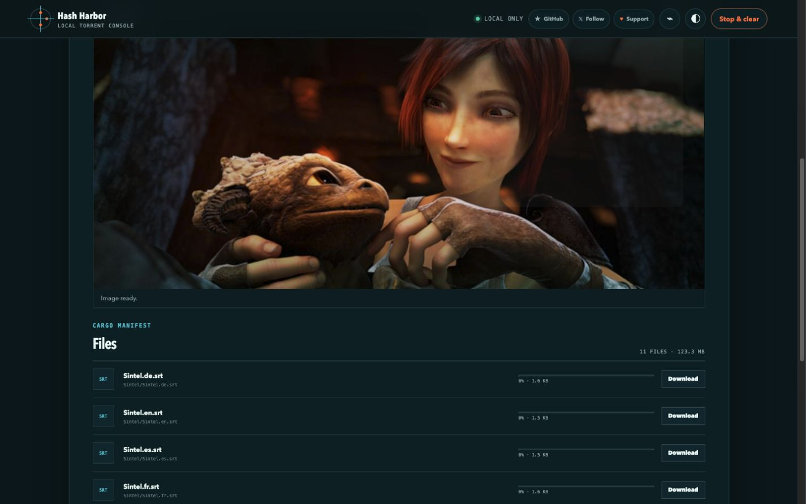

# Hash Harbor

[](https://www.npmjs.com/package/hash-harbor)
[](https://github.com/apoorvdarshan/hash-harbor/releases/latest)
[](LICENSE)

**A local torrent streamer and downloader that lives at a permanent localhost
address.**

[Website](https://hash-harbor.apoorvdarshan.com) ·
[Product Hunt](https://www.producthunt.com/products/hash-harbor) ·
[npm](https://www.npmjs.com/package/hash-harbor) ·
[Releases](https://github.com/apoorvdarshan/hash-harbor/releases)



Hash Harbor combines a native BitTorrent engine with a clean browser interface.
Paste a BitTorrent v1 magnet link or info hash, inspect every file, stream
supported media, preview common formats, or download only what you need. The
engine and files stay on your computer; there is no hosted torrent backend.

## Quick start

Requires Node.js 20 or newer:

```bash
npx hash-harbor
```

The launcher downloads the matching checksum-verified native binary, starts it,
and opens <http://localhost:3210>. The port remains predictable, so the address
can be bookmarked like a local app.

Native binaries are published for macOS, Linux, and Windows on Intel and ARM.
They can also be downloaded directly from
[GitHub Releases](https://github.com/apoorvdarshan/hash-harbor/releases).

## Features

- Native BitTorrent TCP, UDP, tracker, and DHT connectivity
- Stream supported audio and video while pieces download
- Browser playback controls including seeking, volume, and fullscreen
- Optional FFmpeg conversion for formats such as MKV and AVI
- Image, text, and PDF previews
- Per-file downloads without unpacking the entire torrent
- Live peer, speed, progress, and metadata status
- Permanent localhost address with a configurable port
- macOS start-at-login service
- Responsive light and dark browser interface

## Keep it available after restart

Install the macOS background service once:

```bash
npx hash-harbor install-service
```

Useful commands:

```bash
npx hash-harbor status
npx hash-harbor open
npx hash-harbor config --port 3210
npx hash-harbor start-service
npx hash-harbor stop-service
npx hash-harbor uninstall-service
```

The port can also be changed from the settings panel. Hash Harbor validates the
new port, saves it, restarts its local HTTP listener, and redirects the browser.
It never silently switches to a random port.

On macOS, configuration, service logs, and torrent data live under
`~/Library/Application Support/Hash Harbor/`. Uninstalling the service keeps
downloads and settings.

## How it works

The browser interface is served by a native process bound to `127.0.0.1`. That
engine can connect to ordinary BitTorrent peers, trackers, and DHT—unlike a
browser-only WebTorrent client, which is limited to WebRTC-compatible peers and
web seeds.

Torrent traffic still travels between your computer and peers. Localhost means
the control interface is local; it does not provide anonymity.

## Run from source

Requirements:

- Go 1.25 or newer
- FFmpeg (optional, for converting unsupported browser playback formats)

```bash
go run .
```

Open <http://localhost:3210>.

For launcher development, build the engine and point the npm CLI at it:

```bash
go build -o dist/hash-harbor-dev .
HASH_HARBOR_BINARY="$PWD/dist/hash-harbor-dev" node bin/hash-harbor.js
```

Run all tests:

```bash
go test ./...
npm test
```

## Automated releases

Ordinary branch pushes do not publish packages. A semantic version tag runs the
test suite, builds six native binaries, creates SHA-256 checksums, publishes a
GitHub Release, and publishes the matching npm launcher version.

```bash
git tag v0.1.3
git push origin v0.1.3
```

## Privacy and permitted use

Hash Harbor is not a VPN or anonymity service. Torrent peers can see your public
IP address. Use it only for files you have permission to access and share.

## Support

If Hash Harbor is useful, you can
[star it on GitHub](https://github.com/apoorvdarshan/hash-harbor),
[follow @apoorvdarshan](https://x.com/apoorvdarshan), or
[support development on Ko-fi](https://ko-fi.com/apoorvdarshan).

## License

Hash Harbor is released under the [MIT License](LICENSE).
